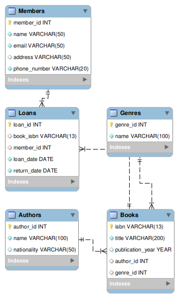

# Library Database

This project defines a relational database schema for managing a library system. The database is designed to store information about books, authors, genres, members, and loans. It is implemented using SQL and includes tables with relationships to ensure data integrity.

## ERD (Diagram)

## My project files are:
- `lib.sql`
- `README.md`

## How to Run/Setup
1. Install `MySQL` on your computer.

2. Open `MySQL` and run the `library.sql` file:
   - `lib.sql;`

3. Check the tables with commands like `SELECT * FROM Books;`.

## Database Structure

The database consists of the following tables:

### 1. `Authors`
Stores information about book authors.

- **Columns**:
  - `author_id` (INT, Primary Key, Auto Increment): Unique identifier for each author.
  - `name` (VARCHAR(100), NOT NULL): Name of the author.
  - `nationality` (VARCHAR(50)): Nationality of the author.

### 2. `Genres`
Stores information about book genres.

- **Columns**:
  - `genre_id` (INT, Primary Key, Auto Increment): Unique identifier for each genre.
  - `name` (VARCHAR(100), NOT NULL, UNIQUE): Name of the genre.

### 3. `Books`
Stores information about books in the library.

- **Columns**:
  - `isbn` (VARCHAR(13), Primary Key): Unique identifier for each book (ISBN).
  - `title` (VARCHAR(200), NOT NULL): Title of the book.
  - `publication_year` (YEAR): Year the book was published.
  - `author_id` (INT, Foreign Key): References `Authors(author_id)`.
  - `genre_id` (INT, Foreign Key): References `Genres(genre_id)`.

### 4. `Members`
Stores information about library members.

- **Columns**:
  - `member_id` (INT, Primary Key, Auto Increment): Unique identifier for each member.
  - `name` (VARCHAR(50), NOT NULL): Name of the member.
  - `email` (VARCHAR(50), NOT NULL, UNIQUE): Email address of the member.
  - `address` (VARCHAR(50)): Address of the member.
  - `phone_number` (VARCHAR(20), NOT NULL): Phone number of the member.

### 5. `Loans`
Tracks the borrowing and returning of books by members.

- **Columns**:
  - `loan_id` (INT, Primary Key, Auto Increment): Unique identifier for each loan.
  - `book_isbn` (VARCHAR(13), Foreign Key): References `Books(isbn)`.
  - `member_id` (INT, Foreign Key): References `Members(member_id)`.
  - `loan_date` (DATE, NOT NULL): Date the book was borrowed.
  - `return_date` (DATE, NOT NULL): Date the book was returned.

## Sample Data

The database includes some initial data:

- **Genres**:
  - `Fantasy`
- **Authors**:
  - `J.K. Rowling`

## How to Use

1. Create the database by running the SQL script in `lib.sql`.
2. Use the `Library` database to manage books, authors, genres, members, and loans.
3. Extend the database by adding more records or modifying the schema as needed.

## License

This project is open-source and can be used freely for educational or personal purposes.